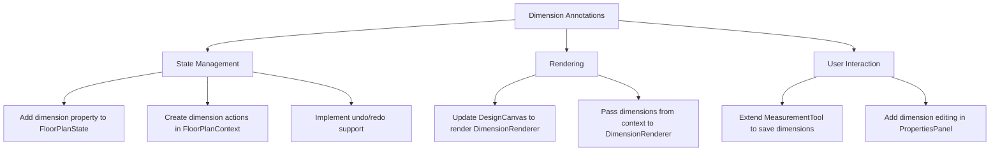

# Dimension Annotations Architecture

## Overview
This document outlines the architecture for implementing dimension annotations in the floor plan application. The implementation will extend the MeasurementTool to support permanent dimension lines, create a DimensionRenderer component, implement dimension editing, add style configuration, and integrate with the unit conversion system.

## Key Components

### 1. State Management
- Add `dimensions: Record<string, Dimension>` to FloorPlanState
- Create new actions:
  - `ADD_DIMENSION`: Add new dimension annotation
  - `UPDATE_DIMENSION`: Modify existing dimension
  - `DELETE_DIMENSION`: Remove dimension
- Update history handling to include dimension state

### 2. Rendering
- Modify `DesignCanvas.tsx` to include `<DimensionRenderer>` component
- Pass dimensions from context: `dimensions={Object.values(state.dimensions)}`
- Make DimensionRenderer respect visibility settings

### 3. User Interaction
- Update MeasurementTool to dispatch ADD_DIMENSION when measurements are created
- Add dimension editing capabilities to PropertiesPanel:
  - Edit dimension style (color, arrow style, etc.)
  - Move/resize dimension lines
  - Delete dimensions

### 4. Unit Conversion
- Integrate useUnitSystem hook to handle unit conversions
- Add unit conversion to DimensionRenderer label formatting
- Ensure dimensions update when unit system changes

## Implementation Steps

1. **Update Type Definitions**
   - Add Dimension interface to floorPlanTypes.ts
   - Add dimensions property to FloorPlanState

2. **Modify FloorPlanContext**
   - Add initial dimensions state
   - Implement dimension actions in reducer
   - Add dimension methods to context value

3. **Update MeasurementTool**
   - Dispatch ADD_DIMENSION when creating measurements
   - Save measurement settings as dimension defaults

4. **Enhance DimensionRenderer**
   - Connect to global state via context
   - Add unit conversion for labels
   - Implement editing handlers

5. **Integrate with DesignCanvas**
   - Add DimensionRenderer component to canvas
   - Pass necessary props from context

6. **Add PropertiesPanel Support**
   - Create dimension editing UI
   - Connect to dimension update/delete actions

## Dependencies
- React Konva for rendering
- FloorPlanContext for state management
- useUnitSystem for unit conversions
