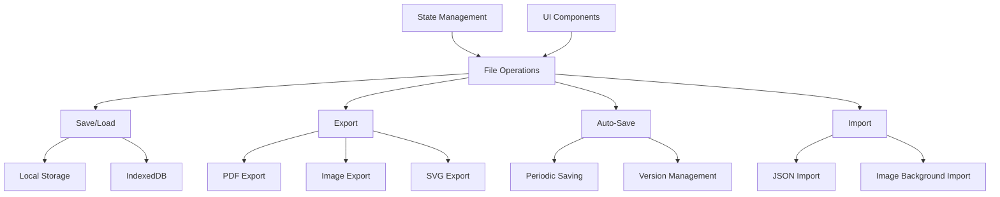

# File Operations System Design

## 1. System Architecture


## 2. File/Module Structure
```
src/
├── utils/
│   ├── fileOperations.ts        # Core file operations
│   ├── storage/                 # Storage implementations
│   │   ├── localStorage.ts
│   │   ├── indexedDB.ts
│   │   └── fileSystem.ts
│   ├── export/                  # Export implementations
│   │   ├── pdfExporter.ts
│   │   ├── imageExporter.ts
│   │   └── svgExporter.ts
│   └── import/                  # Import implementations
│       ├── jsonImporter.ts
│       └── imageImporter.ts
├── context/
│   └── FileOperationsContext.tsx # Context API integration
└── components/ui/
    ├── ExportDialog.tsx         # Export UI
    └── ImportDialog.tsx         # Import UI
```

## 3. API Specifications

### 3.1 Save/Load API
```typescript
interface FileOperations {
  saveProject(data: ProjectData, storageType: 'local' | 'indexedDB'): Promise<void>;
  loadProject(storageKey: string): Promise<ProjectData>;
  listSavedProjects(): Promise<Array<{key: string, name: string, date: Date}>>;
}
```

### 3.2 Export API
```typescript
interface ExportAPI {
  exportPDF(options: PDFExportOptions): Promise<Blob>;
  exportImage(options: ImageExportOptions): Promise<Blob>;
  exportSVG(options: SVGExportOptions): Promise<Blob>;
}

interface PDFExportOptions {
  paperSize: 'A4' | 'A3' | 'Letter';
  orientation: 'portrait' | 'landscape';
  includeGrid: boolean;
  includeDimensions: boolean;
}

interface ImageExportOptions {
  format: 'png' | 'jpg';
  resolution: number; // DPI
  backgroundColor: string;
}

interface SVGExportOptions {
  precision: number;
  embedFonts: boolean;
}
```

### 3.3 Auto-Save API
```typescript
interface AutoSaveAPI {
  enableAutoSave(interval: number): void;
  disableAutoSave(): void;
  getAutoSaveVersions(): Array<AutoSaveVersion>;
  restoreVersion(versionId: string): Promise<ProjectData>;
}

interface AutoSaveVersion {
  id: string;
  timestamp: Date;
  preview: string; // Base64 thumbnail
}
```

### 3.4 Import API
```typescript
interface ImportAPI {
  importProject(file: File): Promise<ProjectData>;
  importBackgroundImage(file: File): Promise<string>; // Returns data URL
  validateProjectFile(data: any): boolean;
}
```

## 4. Integration Points with Existing Components

### 4.1 State Management Changes
```typescript
// In FloorPlanContext.tsx
interface FloorPlanState {
  // Existing state properties...
  fileOperations: {
    autoSaveEnabled: boolean;
    lastSaved: Date | null;
    currentFile: string | null;
    versions: AutoSaveVersion[];
  };
}

// New actions
const fileOperationsReducer = (state, action) => {
  switch (action.type) {
    case 'SET_AUTO_SAVE':
      return { ...state, autoSaveEnabled: action.payload };
    case 'SET_LAST_SAVED':
      return { ...state, lastSaved: action.payload };
    // Other cases...
  }
};
```

### 4.2 UI Component Integration
- **ExportDialog.tsx**: Add format selection (PDF/PNG/JPG/SVG) and options panel
- **ImportDialog.tsx**: Add file type filtering (JSON/images) and preview
- **StatusBar.tsx**: Add auto-save indicator and last saved timestamp
- **RecentFiles.tsx**: Display list of locally saved projects

## 5. Implementation Plan

1. **Storage Layer**:
   - Implement localStorage and IndexedDB adapters
   - Add versioning system with metadata

2. **Export Services**:
   - Enhance PDF export with jsPDF advanced features
   - Implement high-res image export using canvas scaling
   - Optimize SVG export with precision controls

3. **Auto-Save System**:
   - Create background service with configurable intervals
   - Implement version pruning (keep last 10 versions)
   - Add visual indicators in UI

4. **Import Handlers**:
   - Create JSON schema validator
   - Implement background image processing
   - Add error handling for invalid files

5. **UI Integration**:
   - Add export/import options to toolbar
   - Create auto-save status indicator
   - Implement project browser dialog
