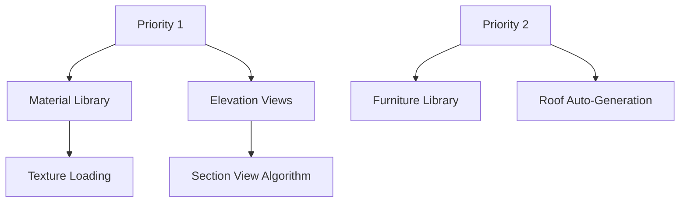
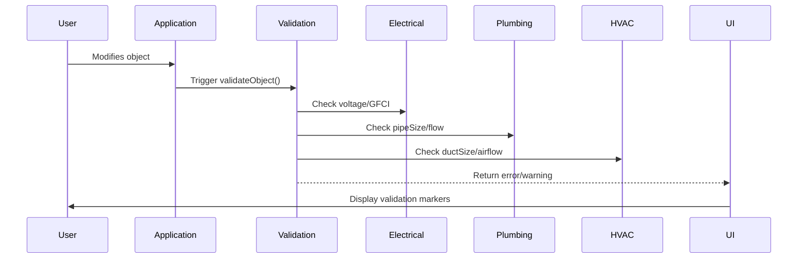

# Project Final Report: Floor Plan Designer

## 1. Implemented Features
### Core Functionality
- **Canvas Interaction**: Zoom, pan, selection, object manipulation, undo/redo
- **Grid System**: Configurable grid with snap-to-grid/objects/guides
- **Layer Management**: Create/rename/delete layers, visibility/lock toggles
- **File Operations**:
  - Save/load projects to localStorage/IndexedDB
  - Export to PDF/PNG/JPG/SVG formats
  - Import JSON projects and background images
- **Drawing Tools**:
  - Wall, door, window, and room tools with property configuration
  - Measurement tool for distance/area/angles
  - Dimension annotations with styling options

### Advanced Features
- **State Management**: Context API with comprehensive reducer
- **Validation System**: Real-time validation for electrical, plumbing, and HVAC elements
- **Unit Conversion**: Imperial/metric conversion system
- **History Management**: Unlimited undo/redo with versioning

## 2. Remaining Gaps & Recommendations
### Critical Gaps
1. **Material Library**: Not implemented (specified in feature docs)
2. **Advanced 2D Views**: Elevation/section views not implemented
3. **Roof Tool**: Basic implementation exists but lacks auto-generation
4. **Furniture Library**: Missing drag-and-drop functionality
5. **Auto-Save**: Designed but not fully implemented

### Recommendations


## 3. Architectural Decisions
### Key Design Choices
1. **State Management**:
   - Centralized context provider (`FloorPlanContext`)
   - Immutable state updates with history tracking
   - Optimized performance with selective re-renders

2. **Validation System**:
   - Modular validation rules per object type
   - Extensible validation interface
   - Real-time feedback in UI

3. **File Operations**:
   - Abstract storage interface (localStorage/IndexedDB)
   - Separation of export formats into dedicated modules
   - Async operations with error handling

4. **Rendering Architecture**:
   - Canvas-based rendering with React Konva
   - Layer-based rendering pipeline
   - Snap indicators and dimension renderers

## 4. Validation Rules
### Implemented Validation
```typescript
// Electrical Elements
voltage: [120, 240] // Required values
weatherproof: Requires GFCI protection

// Plumbing Elements
pipeSize: ['1/2"', '3/4"', '1"', '1.5"', '2"'] // Allowed sizes
flow_rate: Max 2.5 GPM for fixtures

// HVAC Elements
ductSize: Required for ducts
airflow: Non-negative values

// Dimensions
linear: Requires endPoint
angular: Requires centerPoint
```

### Validation Workflow


## 5. Future Development Instructions
### Implementation Priorities
1. **Material Library**:
   - Create texture loading system
   - Implement material property inheritance
   - Add UI for material selection

2. **Advanced Views**:
   - Develop section view algorithm (`useSectionLines` hook)
   - Implement elevation view generator
   - Create view management system

3. **Auto-Save System**:
   - Complete background service
   - Implement version pruning
   - Add UI indicators

4. **Performance Optimization**:
   - Implement object culling for large projects
   - Add Web Workers for export operations
   - Optimize Konva rendering

### Code Integration Points
- **Material Library**: Extend `MaterialSpec` interface
- **Elevation Views**: Create `ElevationViewer` component
- **Auto-Save**: Connect to `FileOperationsContext`
- **Performance**: Add virtualization to `DesignCanvas`

### Testing Strategy
1. Unit tests for validation rules
2. Integration tests for file operations
3. Visual regression tests for rendering
4. Load testing for large projects
